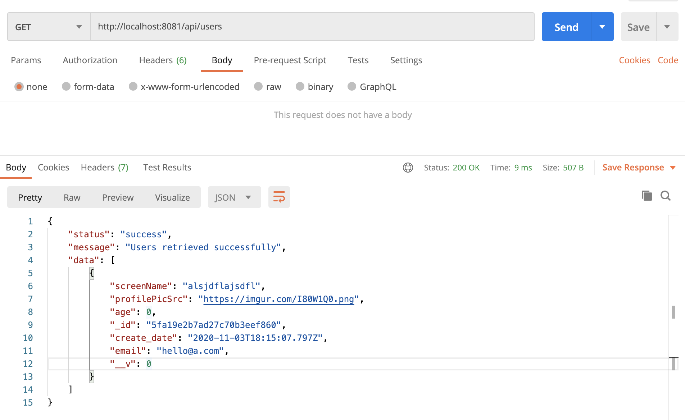
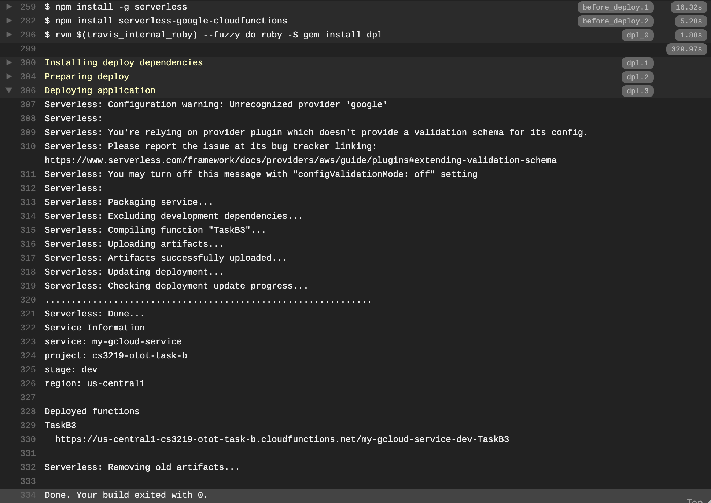
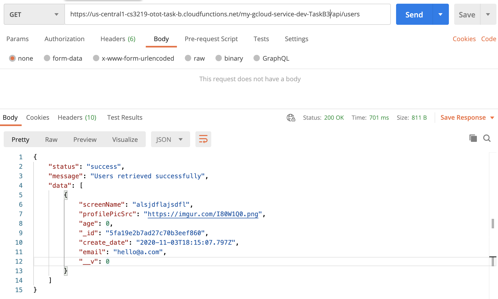
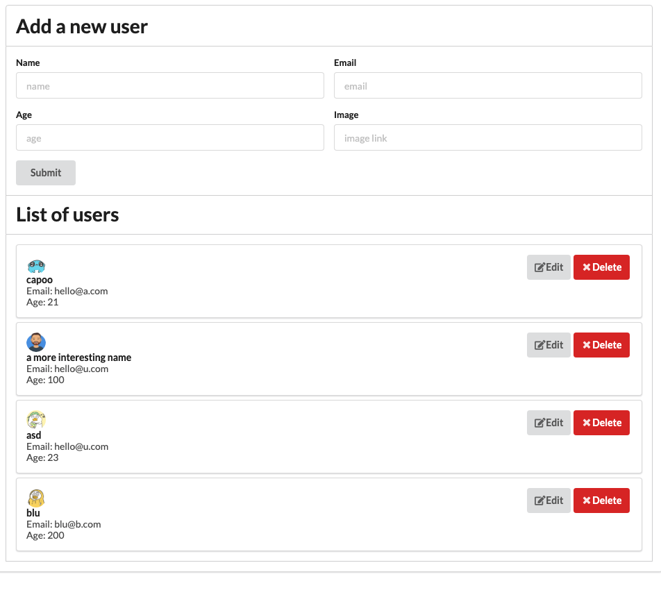

# CS3219-Task-B: Nodejs Serverless Backend & React Frontend SPA

[travis build history link]: https://travis-ci.com/github/Guofeng-Tang/CS3219-OTOT-Tasks/builds
[gcloud function link]: https://us-central1-cs3219-otot-task-b.cloudfunctions.net/my-gcloud-service-dev-TaskB3

## API endpoints

| Method   | Endpoint | Function
| -------- | -------- | --------
| `GET`    | `/api/users` | to fetch all users details
| `POST`   | `/api/users` | to create a new user
| `GET`    | `/api/users/:user_id` | to fetch a single user's details
| `PUT`    | `/api/users/:user_id` | to update a single user's details
| `DELETE` | `/api/users/:user_id` | to delete a single user's details

## Instructions

### Task B1

* First change to directory `myapp`, install dependency and start server with `npm install && npm start`

  ```bash
  cd frontend
  npm install && npm start
  ```

* The backend server will be running on port `8081` at `http://localhost:8081`
* Postman screenshot:
  * 

### Task B2

* Run the test locally at directory `myapp` with `npm test`
* How `/myapp/.travis.yml` initiates testing:
  1. `before_install: cd myapp` changes the current dir to `/myapp`
  2. `install: - npm install` installs the package dependencies
  3. `script: - npm test` initiate the testing
  4. Travis build history can be accessed [travis build history link][travis build history link]

### Task B3

* Function is deployed as a Google Cloud Function automatically with the help of Travis and Serverless at [gcloud function link][gcloud function link]
* Travis build history: [travis build history link][travis build history link]
* Travis successful deployment screenshot:
  * 
* Postman screenshot:
  * 

### Task B4

* Frontend is developed using React and styling is done using Semantic UI.
* Uses previously deployed Google Cloud Function as backend so may not be very responsive.
* To start the dev frontend server:

  ```bash
  cd frontend
  npm install && npm start
  ```

* Screenshot:
  * 
