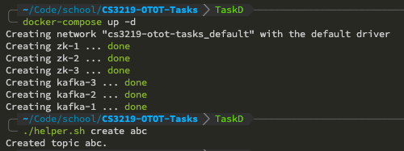
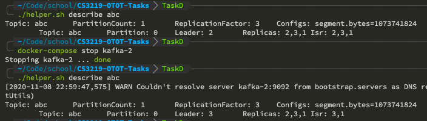
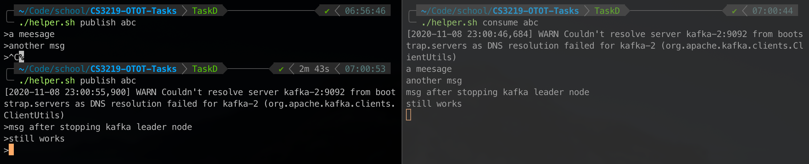
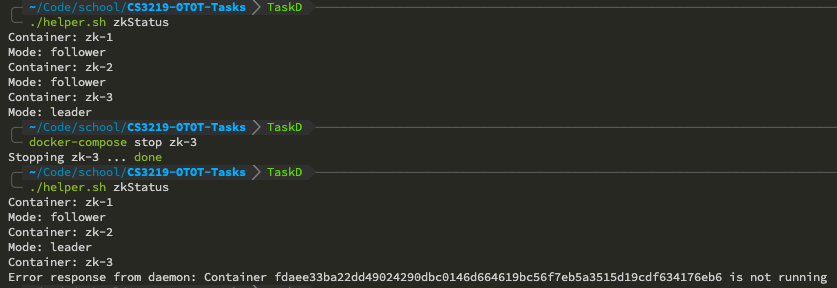
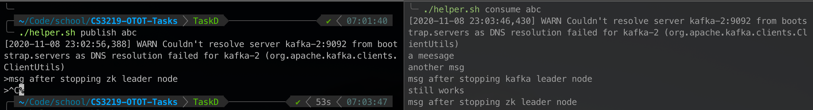

# Kafka & Zookeeper Cluster Failover demo

This project consists of a Docker compose file that creates a 3 Kafka node cluster with 3 Zookeeper node ensemble, as well as a bash script for common operations.

## Kafka Failover Demo

1. Make helper script executable:

    ```bash
    chmod +x ./helper.sh
    ```

2. Start the cluster and create a topic called `abc` using the helper script:

    ```bash
    docker-compose up -d
    ./helper.sh create abc
    ```

    Execution result screenshot:

    

3. Open two more terminals and test pub-sub messaging functionality:

    - Terminal 1:

        ```bash
        ./helper.sh publish abc
        ```

    - Terminal 2:

        ```bash
        ./helper.sh consume abc
        ```

    Execution result screenshot:

    

4. Find out which Kafka is leader and stop the container:

    ```bash
    ./helper.sh describe abc
    ```

    In this case the Kafka leader node has a ID of `2`, stop the container with:

    ```bash
    docker-compose stop kafka-2
    ```

    Execution result screenshot:

    

5. Test pub-sub messaging functionality after stopping Kafka leader node:

    Execution result screenshot:

    

## Zookeeper Failover Demo

1. Find out which Zookeeper node is leader and stop it:

    ```bash
    ./helper.sh zkStatus
    docker-compose stop zk-3
    ```

    Execution result screenshot:

    

2. Test pub-sub messaging functionality after stopping Zookeeper leader node:

    Execution result screenshot:

    
